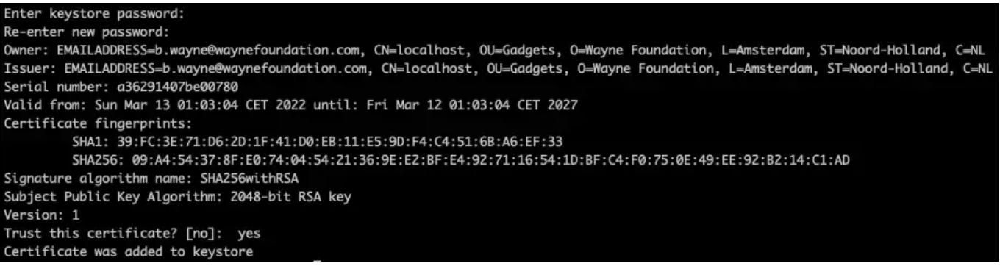

# MTLS

Este projeto foi criado com o intuito de aprender de forma prática como funciona a comunicação http utilizando MTLS. Neste repsórito tem um projeto server e um de client onde o intuito é termos uma comunicação client server utilizando MTLS.

#### Ferramentas necessárias
* [Java 11](https://www.oracle.com/br/java/technologies/javase/jdk11-archive-downloads.html)
* [OpenSSL](https://www.openssl.org/source/)


#### Gerando Certificados Raiz
Supondo que a CLI do openssl já esteja instalada, siga as etapas abaixo para gerar um certificado raiz autoassinado. Nós o usaremos para assinar certificados de cliente e servidor posteriormente nesta história.

O comando abaixo gera uma chave privada e cria o certificado para a Raiz Certificadora
```shell
openssl req -x509 -nodes -sha256 -days 1825 -newkey rsa:2048 -keyout rootCA.key -out rootCA.pem -subj "/C=BR/ST=SP/L=São Paulo/O=ICP Brasil/OU=Certificadora ICP/CN=www.icpbrasil.com.br/emailAddress=bank@cora.com.br"
```
No parametro `-subj` estamos definindo as informações da certificadora raiz, abaixo temos um exemplo dos dados solicitados para emissão do certificado.


----------

#### Gerando Certificado de Servidor

Primeiramente vamos criar uma chave privada e um CSR, veja que aqui também informamos o parametro `-subj` que contém informações da empresa que está emitindo o certificado
```shell
openssl req -x509 -nodes -sha256 -days 365 -newkey rsa:2048 -keyout server.key -out server.csr -subj "/C=BR/ST=SP/L=São Paulo/O=Cora Bank/OU=DevOps/CN=www.cora.com.br/emailAddress=bank@cora.com.br"
```

O CSR devem ser fornecidos pela entidade que solicita o certificado e, em seguida, passado para a CA raiz. Nesse caso, como também atuamos como CA raiz, vamos assinar o certificado do servidor com o CSR fornecido
```shell
openssl x509 -in server.csr -CA rootCA.pem -CAkey rootCA.key -CAcreateserial -out server.pem -days 365 -sha256
```

----------

#### Certificado de assinatura do cliente
Conforme mencionado anteriormente, o TLS mútuo é baseado na autenticação mútua de ambas as partes. Se fosse TLS unidirecional, não precisaríamos do certificado do cliente, porque o servidor não o solicitaria. Neste caso, porém, gostaríamos que o cliente apresentasse seu certificado e que o servidor o autenticasse. Vamos criar certificados de cliente para que possamos usá-los para chamar a API.

Como no certificado do servidor, começamos aqui também a criar a chave privada e o CSR e também informamos o `-subj`.
```shell
openssl req -x509 -nodes -sha256 -days 365 -newkey rsa:2048 -keyout client.key -out client.csr -subj "/C=BR/ST=MG/L=Belo Horizonte/O=Serasa/OU=Serasa TI/CN=www.serasa.com.br/emailAddress=tecnologia@serasa.com.br"
```

Em seguida passamos o certificado para CA raiz assinar da mesma maneira que fizemos com o certificado do servidor.
```shell
openssl x509 -in client.csr -CA rootCA.pem -CAkey rootCA.key -CAcreateserial -out client.pem -days 365 -sha256
```

Excelente! Agora temos certificados de cliente e servidor. Vamos usar esses certificados para proteger nosso aplicativo de inicialização Spring.

----------

#### Configurando o TLS no projeto
O Spring fornece um conjunto de configurações por meio das quais você pode introduzir o certificado. Ele espera o certificado e sua chave privada correspondente em um armazenamento de chaves agrupadas no formato JKS ou PKCS#12. A keytool, que é uma ferramenta para gerar armazenamentos de chaves, mudou o tipo de armazenamento padrão para PKCS12 do JDK 9+ e, aparentemente, o JKS não será mais suportado. Seguindo o mesmo caminho, também agruparemos nosso certificado de servidor e sua chave em um armazenamento de chaves PKCS12.

Navegue até o diretório onde você tem os certificados e execute o seguinte comando para criar um armazenamento de chaves a partir do certificado do servidor e sua chave privada.
```shell
openssl pkcs12 -export -in server.pem -out keystore.p12 -name server -nodes -inkey server.key
```

Isso exportará o certificado e a chave privada para um armazenamento de chaves no formato PKCS, que podemos usar para configurar o aplicativo Spring. Por padrão, a chave privada é importada para o armazenamento de chaves criptografada, caso em que precisaremos instruir o Spring a descriptografá-la usando sua senha. Para esta história, vamos descriptografar a chave privada antes de importá-la. Os nós cuidarão disso no comando acima, que solicitará a senha da chave. A CLI também solicitará uma senha para o armazenamento de chaves que precisaremos fornecer ao Spring posteriormente. Portanto, anote-o!

Agora vamos colocar o arquivo keystore.p12 gerado no diretório src/main/resources/certificates de nosso aplicativo.

Para configurar o tls no projeto devemos configurar o aplication.properties com os seguintes parametros
```shell
server.port=8443
server.ssl.enabled=true
server.ssl.key-store=classpath:certificates/keystore.p12
server.ssl.key-store-password=1234
server.ssl.key-store-type=PKCS12
server.ssl.protocol=TLS
server.ssl.enabled-protocols=TLSv1.2
```

Observação: se a chave foi importada para o armazenamento de chaves criptografada, a senha-chave deve ser fornecida para descriptografar a chave privada.

Inicie o aplicativo e veja se o https está ativo, conforme o log abaixo
```shell
Tomcat started on port(s): 8443 (https) with context path ‘’
```

O comando abaixo também valida se o TLS está ativo
```shell
openssl s_client -connect localhost:8443
```

Com estas configurações já temos o TLS ativo no servidor, faça um teste e veja que agora é preciso acessar o endpoint usando o protocolo seguro `https`.

Se você usar um cliente de API como Postman, receberá uma resposta como a Bad Request. This combination of host and port requires TLS, que está nos dizendo para usar https em vez de http.

Parece que o Postman não pode verificar o certificado do nosso servidor durante o aperto de mão, o que faz sentido porque o Postman não tem ideia de que somos uma autoridade de certificação. Ele já confia em outras CAs públicas na Internet, mas de alguma forma precisamos fazer com que o Postman confie em nós como uma CA raiz.

Navegue até as preferências do Postman e, em seguida, na guia certificados, onde você pode adicionar certificados às suas solicitações com base no nome do host e no número da porta. Há uma seção na parte superior intitulada Certificados de CA que fornece a capacidade de confiar manualmente em uma CA. Esta é uma das etapas na configuração do TLS, unidirecional ou mútuo

Ative a alternância e selecione o arquivo rootCA.pem para que o Postman possa confiar na CA (nós). Execute novamente a solicitação e a conexão deve ser verificada agora.

----------

#### Ativando o TLS mútuo (MTLS)
Até agora, nosso servidor de API tem sua configuração de TLS unidirecional e os clientes que confiam na CA raiz podem enviar solicitações. No entanto, para obter a autenticação mútua entre o cliente e o servidor, precisamos alterar um pouco nossa configuração para que nosso servidor também solicite o certificado do cliente. Navegue até o arquivo application.properties e adicione as seguintes propriedades:
```shell
server.ssl.client-auth=need
```
Essa chave nos permite configurar se queremos autenticação do cliente (também conhecida como autenticação mútua) ou não. Pode ser NEED , WANT e NONE . NEED indica que o servidor deve validar o certificado do cliente enquanto WANT também solicita o certificado do cliente com a principal diferença de que mantém a conexão se nenhuma autenticação for fornecida. Usando NONE, o certificado do cliente nunca é solicitado. Reinicie o aplicativo e tente o terminal novamente.

Postman não parece estar feliz com o resultado. Embora o erro seja muito curto e não seja realmente útil, se você enrolar esse endpoint com log detalhado, verá que o aperto de mão com o servidor falhou. Nesse caso, o servidor não pôde verificar o cliente porque o cliente não estava apresentando nenhum tipo de certificado e a conexão caiu durante o handshake. Se você habilitar o registro de depuração no aplicativo Spring, isso deve ficar visível como uma exceção com a mensagem `empty client certificate chain`. O que precisamos fazer para resolver isso é enviar o certificado do cliente junto com a solicitação ao chamar a API.

Navegue até a guia certificados nas preferências do postman novamente e clique em Adicionar certificado e adicione a seguinte entrada:
```shell
- host: localhost
- porta: 8443
- Arquivo CRT: /path/to/client.pem
- Arquivo KEY: /path/to/client. chave
```

Reenvie a solicitação novamente e o Postman reclama do mesmo erro. Embora o cliente e o servidor apresentem seus certificados um ao outro, a conexão ainda falha ao ser estabelecida. Se você examinar o log do seu servidor, poderá rastrear que o SslHandShakeException é gerado sempre que o cliente chama o endpoint e em algum lugar nessas linhas, há uma mensagem dizendo “unknown certificate” . Essa exceção é lançada porque nosso servidor não pode verificar o certificado do cliente porque não confia na CA raiz do certificado do cliente. Ele sabe que é um certificado válido, mas não tem ideia de onde foi assinado e, portanto, rejeita a solicitação.

Acontece que habilitar a autenticação do certificado do cliente requer confiança na CA raiz da outra parte, a menos que seja confiável na Internet. Java faz esse mecanismo de confiança com pacotes de objetos chamados Trust Store . Assim como os armazenamentos de chaves que mantêm o certificado do servidor, os armazenamentos confiáveis ​​contêm certificados nos quais o aplicativo precisa confiar para validar e autenticar clientes. O Java usa seu próprio armazenamento confiável por padrão, que é enviado com todos os JRE(s). No entanto, o Spring fornece flexibilidade suficiente para que possamos apontar um aplicativo para um armazenamento confiável da mesma forma que fizemos com o armazenamento de chaves.

Vamos criar um armazenamento confiável contendo a CA raiz que assinou o certificado do cliente. Navegue até onde estão os certificados do cliente e execute o seguinte comando:

```shel
keytool -import -file rootCA.pem -alias rootCA -keystore truststore.p12
```

Este comando usa o keytool CLI mencionado acima para criar um armazenamento confiável no formato PKCS12. Ele solicita uma senha que precisaremos ao configurar o aplicativo. A CLI mostra as informações do certificado e pergunta se deve confiar no certificado. Informe sim e crie o armazenamento confiável.



Agora vamos colocar o arquivo truststore.p12 dentro da pasta src/main/resources/certificates e no arquivo application.properties vamos adicionar as seguintes propriedades:
```shell
server.ssl.trust-store=classpath:certificates/truststore.p12
server.ssl.trust-store-password=123456
server.ssl.trust-store-type=PKCS12
```

Reinicie o aplicativo e reenvie a solicitação com o Postman. Agora podemos ver que o servidor também aceitou o certificado do cliente como válido , pois confia na autoridade que o assinou.

----------
#### Configurando o TLS no projeto client

Navegue até o diretório onde você tem os certificados e execute o seguinte comando para criar um armazenamento de chaves a partir do certificado do client e sua chave privada.
```shell
openssl pkcs12 -export -in client.pem -out keystore-client.p12 -name client -nodes -inkey client.key
```

Vamos criar um armazenamento confiável contendo a CA Raiz que assinou o Certificado
```shell
keytool -import -file rootCA.pem -alias rootCA -keystore truststore-client.p12
```

Copie os arquivos truststore-client.p12 e keystore-client.p12 para a pasta resources/certificates. Depois disso vamos configurar o application.properties

```shell
server.port=9443
server.ssl.enabled=true
server.ssl.key-store=classpath:certificates/keystore-client.p12
server.ssl.key-store-password=
server.ssl.key-store-type=PKCS12

server.ssl.client-auth=need

server.ssl.trust-store=classpath:certificates/truststore-client.p12
server.ssl.trust-store-password=123456
server.ssl.trust-store-type=PKCS12

```

Inicie o aplicativo e veja se o https está ativo, conforme o log abaixo
```shell
Tomcat started on port(s): 9443 (https) with context path ‘’
```

Com isso terminamos nossa configuração do lado client, agora o que temos que fazer é configurar um http client para enviar o certificado para comunicar o servidor.

Para o http client utilizei o rest template, abaixo temos um exemplo da configuração.

```kotlin
package com.example.ntgateway.config

import java.security.KeyFactory
import java.security.KeyStore
import java.security.PrivateKey
import java.security.cert.Certificate
import java.security.cert.CertificateFactory
import java.security.cert.X509Certificate
import java.security.spec.PKCS8EncodedKeySpec
import java.time.Duration
import java.util.Base64
import javax.net.ssl.KeyManagerFactory
import javax.net.ssl.TrustManagerFactory
import javax.net.ssl.X509TrustManager
import okhttp3.OkHttpClient
import org.apache.http.conn.ssl.NoopHostnameVerifier.INSTANCE
import org.apache.http.conn.ssl.SSLConnectionSocketFactory
import org.apache.http.conn.ssl.TrustSelfSignedStrategy
import org.apache.http.impl.client.HttpClients
import org.apache.http.ssl.SSLContextBuilder
import org.springframework.boot.context.properties.ConfigurationProperties
import org.springframework.boot.context.properties.ConstructorBinding
import org.springframework.context.annotation.Bean
import org.springframework.context.annotation.Configuration
import org.springframework.http.client.HttpComponentsClientHttpRequestFactory
import org.springframework.web.client.RestTemplate

const val PEM_PRIVATE_START = "-+BEGIN [A-Z ]+-+"
const val PEM_PRIVATE_END = "-+END [A-Z ]+-+"
const val TIMEOUT = 1000
const val MAX_CONNECTION = 5

@Configuration
class BeansConfig(
    val certificateConfig: CertificateConfig
) {

    @Bean
    fun restTemplate(): RestTemplate {
        val certificate = buildCertificate()
        val privateKey = buildPrivateKey()
        val keyStore = buildKeyStore(privateKey, certificate)
            .also {
                buildTrustManager(it)
                initKeyStoreManager(it)
            }

        val httpClient = HttpClients.custom()
            .setSSLSocketFactory(SSLConnectionSocketFactory(buildSSLContext(keyStore), INSTANCE))
            .setMaxConnTotal(MAX_CONNECTION)
            .setMaxConnPerRoute(MAX_CONNECTION)
            .build()

        val requestFactory = HttpComponentsClientHttpRequestFactory(httpClient)
            .let {
                it.setReadTimeout(TIMEOUT)
                it.setConnectTimeout(TIMEOUT)
                it
            }

        return RestTemplate(requestFactory)
    }
    
    @Bean
    fun okHttp(): OkHttpClient {
        val certificate = buildCertificate()
        val privateKey = buildPrivateKey()
        val keyStore = buildKeyStore(privateKey, certificate)

        initKeyStoreManager(keyStore)
        val trustManager = buildTrustManager(keyStore)
        val sslContext = buildSSLContext(keyStore)

        return OkHttpClient
            .Builder()
            .sslSocketFactory(sslContext.socketFactory ,trustManager)
            .connectTimeout(Duration.ofMillis(TIMEOUT.toLong()))
            .readTimeout(Duration.ofMillis(TIMEOUT.toLong()))
            .hostnameVerifier(INSTANCE)
            .build()
    }

    private fun buildPrivateKey(): PrivateKey {
        val decode = Base64.getDecoder().decode(certificateConfig.normalizeCertKey())
        val keySpec = PKCS8EncodedKeySpec(decode)
        val keyFactory = KeyFactory.getInstance("RSA")
        return keyFactory.generatePrivate(keySpec)
    }

    private fun buildKeyStore(privateKey: PrivateKey, certificate: Certificate): KeyStore {
        val keyStore = KeyStore.getInstance(KeyStore.getDefaultType())
        keyStore.load(null)
        keyStore.setKeyEntry("client", privateKey,null, arrayOf(certificate))
        return keyStore
    }

    private fun buildCertificate() = CertificateFactory
        .getInstance("X.509")
        .generateCertificate(certificateConfig.certificateStream()) as X509Certificate

    private fun initKeyStoreManager(keyStore: KeyStore): KeyManagerFactory {
        val keyManagerFactory = KeyManagerFactory.getInstance(KeyManagerFactory.getDefaultAlgorithm())
        keyManagerFactory.init(keyStore, null)
        return keyManagerFactory
    }

    private fun buildTrustManager(keyStore: KeyStore) : X509TrustManager = TrustManagerFactory
        .getInstance(TrustManagerFactory.getDefaultAlgorithm())
        .let {
            it.init(keyStore)
            it.trustManagers.first() as X509TrustManager
        }

    private fun buildSSLContext(keyStore: KeyStore) = SSLContextBuilder
        .create()
        .loadTrustMaterial(keyStore, TrustSelfSignedStrategy())
        .loadKeyMaterial(keyStore, null)
        .build()
    
}

@ConstructorBinding
@ConfigurationProperties(prefix = "client.transport")
data class CertificateConfig(
    val cert: String,
    val certKey: String
){
    fun certificateStream() = cert.decode().byteInputStream()

    fun normalizeCertKey() = certKey
        .decode()
        .replace(Regex(PEM_PRIVATE_START), "")
        .replace(Regex(PEM_PRIVATE_END), "")
        .replace(Regex("\\s"), "")
}

private fun String.decode(): String = Base64.getDecoder().decode(this).toString(Charsets.UTF_8)

```

Os certificados enviados pelo http client estão no arquivo de configuração **application.properties** eles foram codificados em Base64 para facilitar a sua manipulação.
```shell

client.transport.cert=${TRANSPORT_CERT:LS0tLS1CRUdJTiBDRVJUSUZJQ0FURS0tLS0tCk1JSUR2VENDQXFVQ0NRQ205Q2N0bDFqOXlEQU5CZ2txaGtpRzl3MEJBUXNGQURDQm9qRUxNQWtHQTFVRUJoTUMKUWxJeEN6QUpCZ05WQkFnTUFsTlFNUlV3RXdZRFZRUUhEQXhUdzRQQ28yOGdVR0YxYkc4eEV6QVJCZ05WQkFvTQpDa2xEVUNCQ2NtRnphV3d4R2pBWUJnTlZCQXNNRVVObGNuUnBabWxqWVdSdmNtRWdTVU5RTVIwd0d3WURWUVFECkRCUjNkM2N1YVdOd1luSmhjMmxzTG1OdmJTNWljakVmTUIwR0NTcUdTSWIzRFFFSkFSWVFZbUZ1YTBCamIzSmgKTG1OdmJTNWljakFlRncweU1qRXlNamd5TURJNU5EZGFGdzB5TXpFeU1qZ3lNREk1TkRkYU1JR2RNUXN3Q1FZRApWUVFHRXdKQ1VqRUxNQWtHQTFVRUNBd0NUVWN4RnpBVkJnTlZCQWNNRGtKbGJHOGdTRzl5YVhwdmJuUmxNUTh3CkRRWURWUVFLREFaVFpYSmhjMkV4RWpBUUJnTlZCQXNNQ1ZObGNtRnpZU0JVU1RFYU1CZ0dBMVVFQXd3UmQzZDMKTG5ObGNtRnpZUzVqYjIwdVluSXhKekFsQmdrcWhraUc5dzBCQ1FFV0dIUmxZMjV2Ykc5bmFXRkFjMlZ5WVhOaApMbU52YlM1aWNqQ0NBU0l3RFFZSktvWklodmNOQVFFQkJRQURnZ0VQQURDQ0FRb0NnZ0VCQU5mY1ZFb1BRdi9TClNJTkJPSXdXcmxWZHprSjhFdTNaYUFjdmcwZU5VRXFVcHNZSW5jUmxIcFNNQnY0SFJGMVYzTUlMZnhCVmVCOC8KRVpIb2Vvd2hob3lwckI5MXY2VU91QUdKMUxGT1QwUVFjdG0rMERkWUppREZTUW1CRVJhYnd6ZWhNSS95bDlpSApyM0NSbEtVSDB4Y3o2K2VjVmxVOUJld2NudXlHeWZLRSttTGwxbERzbFhxUU4rdzVaeG5uWndvY2o1SXA1MEErCjlReXdSbllPNmpCQkVXVHdla2I5MkFmUTB0WTNSa2lYbFBiUWozbHBBaVdNMDJUa1M3bWQrS3RVU0J5Vis4eXkKOGRMWUdueHJ5c1Z1QVZwZUVhUFNKcXlpUUQwZklVTkhXOTRINmFwVzdGWmU0MmxXdjFsS2liOCthdHZHSGtIUwpyMi9ldUw1c3VRRUNBd0VBQVRBTkJna3Foa2lHOXcwQkFRc0ZBQU9DQVFFQUYzcWhnaU1oSHJNd1liU280MzBrCk5hTFpDTzRScFFUOHprS2dmL3hObENYZGN5UGxESGIrdFBuT0RnelZGZldScTZMdXNtYnh3WFRtUXM1akl4Q2MKRTdMK1BTTEtoYWRZWEc1Q1ByWXdJTWZ6RDg1MmJ4aTd1QVEyTlZwZkpNaDNuclpzdzBybjJmZTcwdERRRU11TgpMb2tramxSeHprMlJKSjdGNHdrN21kaDlqY3R3cmp0TXJ6cElaTm5ZaWJBdENkZnk5RzF1eVZhMHNwck9pY01rClZLVjdqWElnMUNaMzVoU084S21tcnZhQXk4a2FseGhhTVI2bTZTUlpFRWpoK0VQY29iRlUxc1RlQ0x1STNZb3YKeitBM09BdTJxMUw5TnF5Y0cyMXM0ai80TERpNS9uT0NtbGJ5TmkxZCsyWmFnMWdjTjVuMHNDVGgyNFJCbVZBdApTQT09Ci0tLS0tRU5EIENFUlRJRklDQVRFLS0tLS0=}
client.transport.cert-key=${TRANSPORT_CERT_KEY:LS0tLS1CRUdJTiBQUklWQVRFIEtFWS0tLS0tCk1JSUV2d0lCQURBTkJna3Foa2lHOXcwQkFRRUZBQVNDQktrd2dnU2xBZ0VBQW9JQkFRRFgzRlJLRDBMLzBraUQKUVRpTUZxNVZYYzVDZkJMdDJXZ0hMNE5IalZCS2xLYkdDSjNFWlI2VWpBYitCMFJkVmR6Q0MzOFFWWGdmUHhHUgo2SHFNSVlhTXFhd2ZkYitsRHJnQmlkU3hUazlFRUhMWnZ0QTNXQ1lneFVrSmdSRVdtOE0zb1RDUDhwZlloNjl3CmtaU2xCOU1YTSt2bm5GWlZQUVhzSEo3c2hzbnloUHBpNWRaUTdKVjZrRGZzT1djWjUyY0tISStTS2VkQVB2VU0Kc0VaMkR1b3dRUkZrOEhwRy9kZ0gwTkxXTjBaSWw1VDIwSTk1YVFJbGpOTms1RXU1bmZpclZFZ2NsZnZNc3ZIUwoyQnA4YThyRmJnRmFYaEdqMGlhc29rQTlIeUZEUjF2ZUIrbXFWdXhXWHVOcFZyOVpTb20vUG1yYnhoNUIwcTl2CjNyaStiTGtCQWdNQkFBRUNnZ0VCQU5DUXFEaHVpcFBYUUF6aUJac0ZoeWdnWE54TU9aWHF5K0sxZTZpMDEzRlkKTTlPQUc3L1kzRFUzSHNKdmp4U0hrNmRCcUdIRjB5eU5xWkpMQjYxQjcxa1Z6Nk1PQ0QrWSt4MHhhWHB2YVpNZwpPWGcrTDd4cHhWMUFnWk5YUzRXR3RwYVhmZTUzdlZPUHRtbVRvQVhjaTQ4TnNjKzFkSTBqU3dlWmw4eDlaNzZVCkNwVFIza2c0dDQ1YnNXeXNJOUhkcDlDbjJXd2s2N2NzeFEyWDV5bnNHTFJacGhQbVl0WGdJdC8zUlhJSDJ3S1oKTnVrOFhDS2xuUEhyM1FTOGZZWFZUUjN6dmxTejdnVkRlcDJpUDNyWlpyUTZ3eERlTVcwd1lYMkVzVUJMdGtCawpCcEQyNnFHa1owcnpHN3dHN1lEVGVVTUt2RnpleFRuTldCOGowUWpKTTRrQ2dZRUErbWY0S3RYa1lEbzF3Y3orCmZxQlhOaXFkRDZYYWVWOXpWdG5UMzhidWk0OGlISkkweHBzbU1ZdFF2d2djWDhpbCtOYVpFc1ZNUHBVWTBKVlYKSzhlaVRDNjZQSjhIZWY5Q1I2bWR4YlRteFcxaW5Cdll0czVOODc1d3FmbzU0UU9CWG1FbXU4VXBxcXNPWDNWQQpWdkIyQ3hMMlJISGlEN3lQNFdmL25ka2NZMnNDZ1lFQTNLN00xRngvSCtyRkRDUk5ORGFUWU1GS21FMG1tdlNMCjgxam1iSnlRbEhJWjlTb2pKWkttMFdtazJuTEJrdXl4NmJ6K0ZOME5Fa0Y2TDBObmZ2VmdNTm9aemlKNmtKeFEKVEZ6b2EwREk1TWpUVHVGN2RPL2liejNrcm1CNERVME1obzFIaDNkRHBtY21tczZaaU94RVBQMjRlR2RmSXQ2dApqVTJZS1NvZEhFTUNnWUFxS2JWOHFQVkNTcXJnamY3UUhYbHgwbTBOeEhScitXbDNWMGc0cHN0bHpsMEZDSTFBClg4Rm5tRGlwWWRrOU81RE92SHViMElMTkN0Zlp6enMvR3VjMkFxd3pKdWZnWDkydUtWNDZld0pjZmRXYnlZaU4KQjJIU3g5ODZqN3FOSzhUdHVsZ0dSK1dES2poS1ZIalg2cmRGbUJURlk1T1g2TDBsVEJpYllJSktMd0tCZ1FDQgpsekIzUUQzeXF6VzlWSS8xcWxyUFJaS2RieWpOYysrL0hpUnFBV0t4bVhOKzBaakVGcU5aZEJVM3BvM2Z6cGtICmJsRXlSVURJeUtTTW5xTm5IWWE0Q1V1QURpVTFTR1dyQWlBRjQ0eFZOVTFKRkFZZ2ZFSFhHMXh2dmZ5aHF1NUIKRVRQQTdCdFEyMkFESm5Gb3czMnE1ejl0alI2RDVvbTU0YWdKL0U0TjZ3S0JnUURlQS9qL1NLSDhzMW5WclVSMQpMTnhReGNkMEpXcHlSTnd4VXFwSUZTTFpOS0ZHSWZBSEZBdlNvMUg5QW92Mk5Ea0IzeDIxb2NDVlAwbEFKQXd1CmZnRFAxcS96L29ZUmo4UzNLeXA4ZUJsUkZ3bkZNS3ZTTVdJTFVUWGpTNHk2RVJFMHRFSmswRFRCbVRqbzhoaDUKdE4zNlpzZGV3REZxUUxPaUNodFh0SjhIalE9PQotLS0tLUVORCBQUklWQVRFIEtFWS0tLS0t}

```
